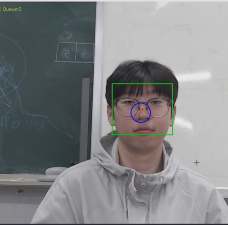
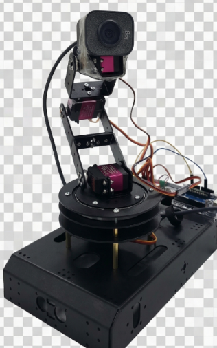

# Face-Tracking Robot Arm Camera System

> 카메라 추적 로봇팔 시스템
>
> 이 저장소는 졸업 캡스톤 프로젝트를 포트폴리오용으로 재구성한 저장소이며, 원본 팀 개발 저장소는 아닙니다.

사용자의 얼굴을 실시간으로 추적해 카메라가 얼굴 중앙을 유지하도록 로봇팔을 자동 제어하는 촬영 보조 시스템입니다. 2025년 3월부터 11월까지 4인 팀으로 진행했고, 최종 발표 기준 FRT·IFR·ICR 정량 지표를 충족해 **정보기술대학장 장려상**을 수상했습니다.

<table>
  <tr>
    <td align="center" valign="middle">
      
    </td>
    <td align="center" valign="middle">
      
    </td>
  </tr>
</table>

## 프로젝트 개요

| 항목 | 내용 |
|------|------|
| 기간 | 2025.03.02 ~ 2025.11.20 |
| 팀 구성 | 4인 팀, 팀장 |
| 최종 시연 환경 | Windows + WSL, Python/OpenCV, Arduino Uno R3, PCA9685 |
| 내 핵심 기여 | 로봇팔 제어 코드 연동, 모터 제어 안정화, 제어 로직 개선 |
| 최종 결과 | 정량 지표 3종(FRT·IFR·ICR) 최종 발표 기준 충족 |
| 수상 | 정보기술대학장 장려상 |

## 시스템 구조

<p align="center">
  
</p>

카메라 입력을 Python/OpenCV에서 처리하고, 얼굴 좌표를 모터 명령으로 바꿔 Arduino와 PCA9685로 전달하는 실시간 추적 시스템입니다. 비전 처리와 제어 명령 생성은 PC에서, 서보 구동은 Arduino에서 담당하는 이중 구조로 설계됐습니다.

자세한 아키텍처는 [시스템 아키텍처](docs/04_architecture.md)에서 확인할 수 있습니다.

## 기술 스택

| 구분 | 기술 |
|------|------|
| 비전/제어 | Python, OpenCV, NumPy, pyserial |
| 얼굴 검출 | OpenCV DNN (SSD ResNet-10, Caffe) |
| 추적 보정 | Kalman Filter, OneEuro Filter |
| MCU | Arduino Uno R3, PCA9685 (I2C PWM) |
| 통신 | USB Serial 115200bps, CSV 프로토콜 |
| 카메라 | Logitech StreamCam (FHD ~50fps) |
| 서보 | DS3230 Pro 180 |

## 내 기여

- 얼굴 좌표를 모터 명령으로 변환하고, Python-Arduino 간 CSV 직렬 통신 브릿지를 구현했습니다.
- 디지털 서보 교체 후 악화된 미세 진동 문제에 대응해 비례제어(`Kp_xy=0.02`), OneEuro 필터, Soft Deadzone, EMA, Adaptive Alpha를 포함한 제어 로직을 재설계했습니다.
- 팀장으로서 역할 배분, 일정 조율, 발표 자료와 문서화를 함께 맡았습니다.
- 비전 처리 전반은 팀원이 주도했고, 저는 해당 파이프라인을 제어 쪽과 연결하고 코드 개선에 참여했습니다.

## 정량 결과

아래 수치는 최종 발표 기준 보고값입니다.

| 지표 | 의미 | 최종 발표 기준 |
|------|------|----------------|
| FRT | 얼굴 재인식 시간 | `1.8초 이내` |
| IFR | 이동 중 추적 안정성 | `벡터 크기 15px 이하 프레임 비율 83% 이상` |
| ICR | 정지 안정성 | `반지름 33px 원 내부 좌표 비율 82% 이상` |

- IFR의 원래 목표는 `20px 이하 80%`였고, 최종 발표에는 더 엄격한 `15px 이하 83%` 결과를 사용했습니다.
- 개선 과정에서 좌표 노이즈 `±5px → ±1px`, 제어 갱신률 `12~25Hz → 66~100Hz`, 카메라 환경 `640×480 30fps → 1920×1080 ~50fps`로 개선됐습니다.
- 최종 테스트는 각 지표를 `3회 연속` 수행했고, 목표를 넘겨 통과한 최대값 기준으로 정리했습니다.

세부 지표 설계와 수정 과정은 [정량 지표](docs/07_quantitative_metrics.md)에서 확인할 수 있습니다.

## 증빙 자료

- [최종 시연 영상](assets/videos/final/20251117_final-demo_whole-shot.mp4)
- [최종 발표 PDF](assets/presentations/final/20251117_2ndSem_12week_presentation_final-presentation-system-overview.pdf)
- [정보기술대학장 장려상 상장](assets/references/award_certificate/2025_info-tech-college-dean-encouragement-award.jpg)
- [최종 포스터](assets/images/poster/final_capstone-panel.jpg)

## 저장소 구조

```
├── src/
│   ├── python/          # 메인 추적·제어 프로그램 (main.py)
│   └── arduino/         # 서보 제어 코드 (arm_init.ino)
├── docs/                # 프로젝트 문서
├── assets/
│   ├── images/          # 다이어그램, 하드웨어 사진, 지표 이미지, 스크린샷
│   ├── videos/          # 시연 영상 (초기/중간/최종)
│   ├── presentations/   # 발표 자료 (phase1/phase2/final)
│   └── references/      # 상장 등 증빙 자료
└── archive/             # 주간 기록 원본
```

## 실행 환경

이 저장소의 코드는 최종 시연 당시의 개발 버전입니다. 실행하려면 아래 환경이 필요합니다.

- **Python 환경**: Python 3.x, OpenCV (`cv2`), NumPy, PIL, pyserial
- **얼굴 검출 모델**: `deploy.prototxt`, `res10_300x300_ssd_iter_140000.caffemodel` (OpenCV DNN Caffe 모델)
- **하드웨어**: Arduino Uno R3, PCA9685, 서보모터, USB 카메라
- **코드 내 경로**: `main.py`에 `COM5`, `C:\face_models\...` 등 Windows 로컬 경로가 하드코딩되어 있어, 실행 시 환경에 맞게 수정이 필요합니다.

현재 저장된 코드는 측정·녹화·평가 루틴이 함께 포함된 개발 버전이며, 최종 시연용 코드는 테스트 루틴을 제거한 상태였습니다.

## 문서

| 문서 | 내용 |
|------|------|
| [프로젝트 요약](docs/01_project_summary.md) | 전체 개요와 진행 흐름 |
| [팀 구성 및 역할](docs/02_team_and_role.md) | 팀원 구성과 역할 분담 |
| [시스템 아키텍처](docs/04_architecture.md) | 하드웨어·소프트웨어 구조와 제어 파이프라인 |
| [정량 지표](docs/07_quantitative_metrics.md) | 지표 설계, 수정, 최종 결과 |
| [트러블슈팅](docs/09_troubleshooting.md) | 핵심 기술 문제와 해결 과정 |
| [프로젝트 회고](docs/11_retrospective.md) | 잘된 점, 어려웠던 점, 배운 점 |
