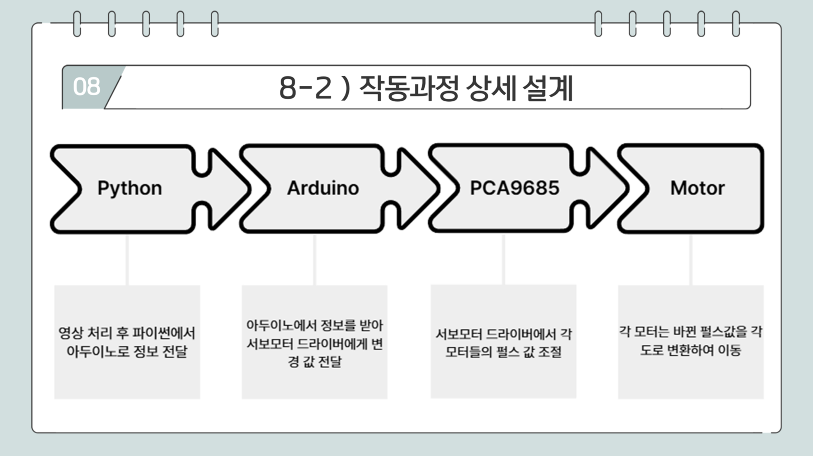
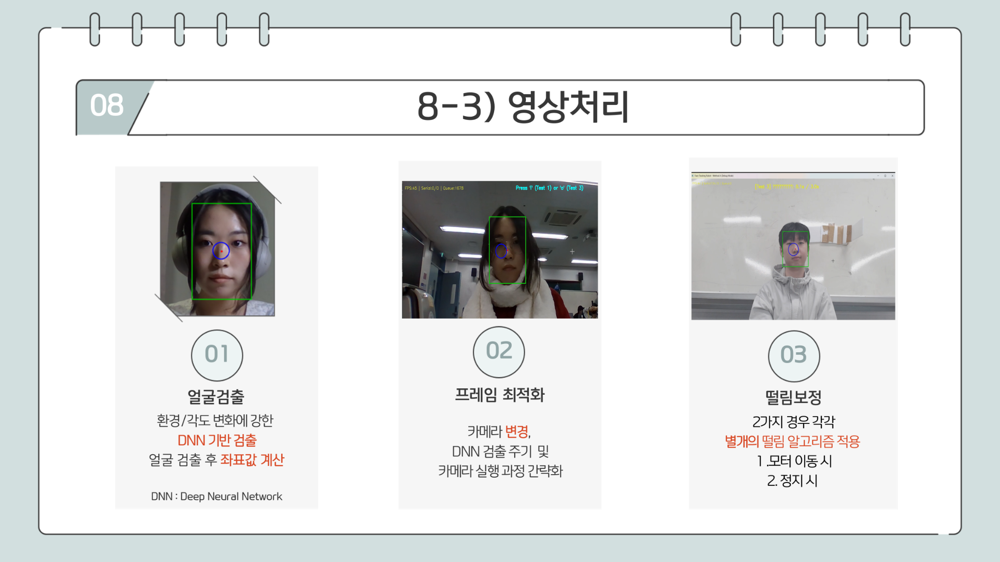

# 시스템 아키텍처

> 하드웨어 구성, 소프트웨어 흐름, 제어 파이프라인, 하드웨어 발전 과정을 한 문서에서 설명한다.

## 시스템 개요

이 시스템은 사용자의 얼굴을 실시간으로 검출하고, 얼굴 중심이 화면 중앙에 유지되도록 로봇팔을 자동 제어하는 촬영 보조 장치다. `비전 처리/제어 생성`과 `모터 실행`이 분리된 이중 구조로 설계됐다.

## 전체 구조

### 작동과정 상세 설계

<p align="center">
  
</p>

### 영상 처리 흐름

<p align="center">
  
</p>

> 전체 다이어그램: [하드웨어 아키텍처](../assets/images/diagrams/01_hardware-architecture_overview.png) · [시스템 흐름](../assets/images/diagrams/02_system-flow_overview.png) · [부품 개요](../assets/images/diagrams/03_hardware-components_overview.png) · [사용자 동작 흐름](../assets/images/diagrams/05_user-flow_tracking-process.png) · [모터 제어 흐름](../assets/images/diagrams/06_control-flow_motor-movement.png)

```text
[카메라]
  -> [Python / OpenCV]
     - 얼굴 검출 (DNN SSD ResNet-10)
     - 추적 보정 (Kalman / OneEuro)
     - 모터 명령 생성
  -> [USB Serial 115200bps]
  -> [Arduino Uno R3]
  -> [PCA9685 50Hz PWM]
  -> [서보모터 구동]
```

Python이 판단하고 Arduino가 실행하는 구조다. 1학기 5주차에 이 이중 구조가 확정됐고, 최종 시연까지 유지됐다.

## 하드웨어

### 최종 시연 구성

| 구성 요소 | 부품 | 역할 |
|------|------|------|
| 카메라 | Logitech StreamCam | FHD 영상 입력 |
| 처리 장치 | Windows PC + WSL | 비전 처리, 제어 명령 생성 |
| MCU | Arduino Uno R3 | 시리얼 명령 수신, PWM 제어 |
| 모터 드라이버 | PCA9685 (I2C, 0x40) | PWM 출력 |
| 서보모터 | DS3230 Pro 180 | 로봇팔 구동 |
| 구조 | 1축 회전 짐벌 포함 | 카메라 흔들림 완화 |

### 하드웨어 변화 과정

| 항목 | 초기 | 최종 | 변경 이유 |
|------|------|------|----------|
| 서보모터 | MG996R | DS3230 Pro 180 | ICR 60% 수준 → 기계적 진동 한계 |
| 카메라 | Logitech C270 (VGA 30fps) | StreamCam (FHD ~50fps) | FHD 고프레임 대응 |
| 구조 | 고정 구조 | 1축 짐벌 추가 | 물리적 흔들림 완화 |
| 처리 환경 | Raspberry Pi 4 검토 흔적 존재 | Windows PC + WSL | 실제 구현은 성능 확보를 위해 PC/노트북 기반으로 정리 |
| 기능 범위 | 음성/조명 포함 | 카메라-로봇팔 추적에 집중 | 핵심 품질 우선 |

- [초기 하드웨어 사진](../assets/images/hardware/1st_semester/1stSem_hardware_initial-robot-arm.png)
- [최종 하드웨어 사진](../assets/images/hardware/2nd_semester/2ndSem_hardware_final-robot-arm.png)
- [모터 업그레이드](../assets/images/hardware/2nd_semester/06_hardware-change_motor-upgrade.png)
- [짐벌 추가](../assets/images/hardware/2nd_semester/07_hardware-change_gimbal-added.png)
- [카메라 업그레이드](../assets/images/hardware/2nd_semester/08_hardware-change_camera-upgrade.png)

## 소프트웨어 흐름

### Python 메인 프로그램 (`src/python/main.py`)

`main.py`는 추적 알고리즘만 담은 모듈이 아니라, 실시간 추적 + 제어 + 실험/평가 + 기록을 통합 운영하는 프로그램이다.

1. 카메라 해상도/FPS, 시리얼 포트, 추적 파라미터를 설정하고 초기화
2. `serial_worker` 스레드로 Arduino 통신 채널을 준비, `CaptureThread`로 프레임을 비동기 수집
3. 메인 루프에서 최신 프레임을 받아 일정 주기마다 얼굴 검출 수행
4. 가장 큰 얼굴 박스를 선택해 중심 좌표 계산
5. Kalman 필터와 OneEuro 필터로 추적/제어용 좌표를 각각 보정
6. 보정된 좌표로 모터 명령을 생성, 큐에 넣으면 시리얼 워커가 최신 명령만 전송
7. 화면 표시용 크롭, 떨림 분석, 녹화, 정량 지표 측정 로직이 같은 루프에서 동작

현재 저장된 코드는 개발·측정 흔적이 함께 남아 있는 버전이며, 최종 시연용 코드는 테스트 루틴을 제거한 상태였다.

### Arduino 실행 계층 (`src/arduino/arm_init.ino`)

Arduino는 복잡한 판단 없이 명령 수신과 PWM 출력에 집중한다.

- `Serial.begin(115200)`으로 시리얼 통신 시작
- PCA9685를 50Hz로 설정
- `readStringUntil('\n')`로 한 줄을 읽고 `strtok()`으로 CSV 파싱
- `moving()`이 `motor_vals`를 PWM 변화량으로 적용
- `checklimit()`으로 채널별 펄스 범위를 제한

## 제어 파이프라인

```text
[얼굴 중심 좌표]
  -> [필터 / 보정]
  -> [모터 명령 생성]
  -> [CSV 직렬 전송 (7개 값 + 개행)]
  -> [Arduino 파싱]
  -> [PCA9685 PWM 출력]
  -> [서보모터 구동]
```

### 모터 축 구성

- `motor_1`: 가장 하단의 좌우 회전 축
- `motor_2`: 그 위 축
- `motor_3`: 엘보우에 가까운 축
- `motor_4`: 카메라 연결부(손목) 축
- `motor_5`, `motor_6`: 관절 수를 줄이는 과정에서 최종 구성에서 제외
- `motor_7`: 서보 축이 아니라 전송 후 대기 시간(delay) 역할

실사용 축은 4개 모터 + delay였고, 반복 제어에서는 주로 `motor_1`, `motor_3`을 사용했다.

### 명령 전달 특성

- 큐에 여러 명령이 쌓이면 최신 명령만 남겨 지연 누적을 방지
- 모터 명령은 Python 쪽 `clip_motor_angles()`와 Arduino 쪽 `checklimit()`에서 이중 제한

## 제어 안정화 포인트

| 기법 | 역할 |
|------|------|
| `DEADZONE_XY` | 얼굴 중심이 화면 중앙 근처일 때 불필요한 미세 제어 억제 |
| `FREEZE_DURATION_S` | 특정 축이 멈춰야 하는 구간에서 추가 보정을 짧은 시간 억제 |
| 이중 클리핑 | Python/Arduino 양쪽에서 모터 범위 제한 |
| 최신 명령 우선 | 큐 적체를 줄여 추적 지연 방지 |
| OneEuro 필터 | DNN 좌표 노이즈 억제 (±5px → ±1px) |
| Optical Flow | 배경 흔들림과 얼굴 박스 출렁임을 구분 |
| 비동기 캡처 | 오래된 프레임을 버리며 가져와 추적 지연 감소 |

현재 코드 기준 실제 반복 제어는 x/y 중심 추적이 중심이며, 거리 기반 z축 제어는 변수가 존재하지만 핵심 명령 생성에서는 사용되지 않는다.

## 기술 스택

| 구분 | 기술 |
|---|---|
| 비전/제어 | Python, OpenCV, NumPy, PIL, pyserial, threading, queue |
| 얼굴 검출 | OpenCV DNN, Caffe 모델 (SSD ResNet-10) |
| 추적 보정 | Kalman Filter, OneEuro Filter |
| 화면 안정화 | Optical Flow (goodFeaturesToTrack, calcOpticalFlowPyrLK) |
| 카메라 | MJPG, 1920×1080, 40fps 설정 |
| MCU 제어 | Arduino C++, Wire, Adafruit PWM Servo Driver |
| 모터 드라이버 | PCA9685, I2C, 50Hz PWM |
| 통신 | USB Serial 115200bps, CSV 패킷 |

## 관련 문서

- [프로젝트 요약](01_project_summary.md)
- [정량 지표](07_quantitative_metrics.md)
- [트러블슈팅](09_troubleshooting.md)
