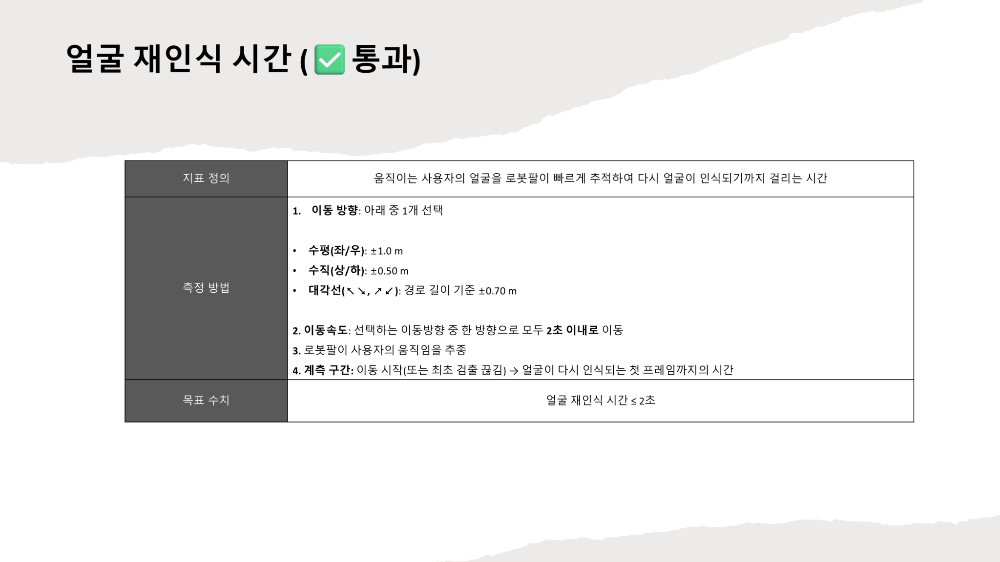
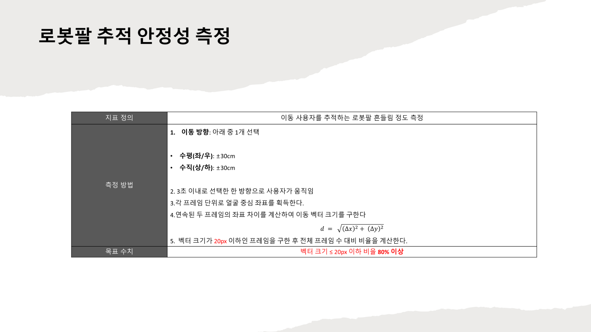
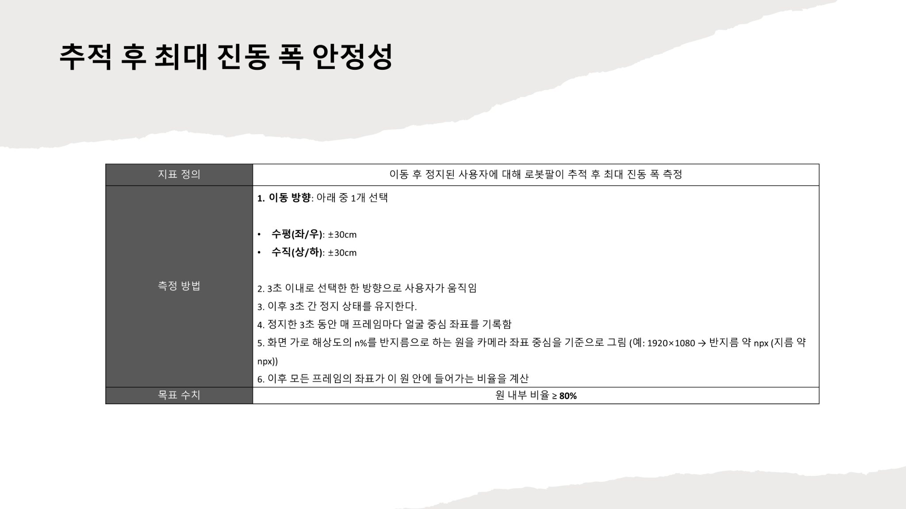

# 정량 지표

> FRT·IFR·ICR 지표가 왜 만들어졌고, 어떤 피드백으로 수정됐으며, 최종적으로 어떤 값이 보고됐는지를 정리한다.

## 지표 개요

프로젝트 후반의 성능 평가는 얼굴 재인식 시간(FRT), 이동 중 추적 안정성(IFR), 정지 안정성(ICR) 3종으로 수렴했다.

| 지표 | 의미 | 최종 발표 기준 보고값 |
|------|------|----------------------|
| FRT | 얼굴 재인식 시간 | `1.8초 이내` |
| IFR | 이동 중 추적 안정성 | `벡터 크기 15px 이하 프레임 비율 83% 이상` |
| ICR | 정지 안정성 | `반지름 33px 원 내부 좌표 비율 82% 이상` |

## 지표 요약 이미지

| FRT (얼굴 재인식 시간) | IFR (이동 중 추적 안정성) | ICR (정지 안정성) |
|:---:|:---:|:---:|
|  |  |  |

> 상세 자료: [FRT 상세](../assets/images/metrics/metric1_frt_detailed-method.png) · [IFR 상세](../assets/images/metrics/metric2_ifr_detailed-method.png) · [ICR 상세](../assets/images/metrics/metric3_icr_detailed-method.png) · [ICR 결과 캡처](../assets/images/metrics/11_metric3_result-screen_and-terminal.png) · [최종 발표 PDF](../assets/presentations/final/20251117_2ndSem_12week_presentation_final-presentation-system-overview.pdf)

## 왜 정량 지표가 필요했는가

2학기 초 팀은 "얼굴을 따라간다"는 수준으로는 시스템 완성도를 설명하기 어렵다고 판단했다. 남아 있던 핵심 문제는 두 가지였다.

- 사용자가 움직일 때 추적이 늦거나 타깃이 바뀌는 문제
- 목표 지점에서 멈췄을 때 로봇팔이 미세하게 흔들리는 문제

초기에는 음성 인식이나 가장 가까운 얼굴 식별 같은 평가 항목도 검토됐지만, 공식 지표는 FRT·IFR·ICR 3종으로 정리됐다.

## 설계와 수정 흐름

### 2학기 1주차: 초안

| 항목 | 초기 아이디어 | 목표 |
|------|-------------|------|
| 지표 1 | 좌우 1m, 상하 50cm를 3초간 움직일 때 로봇팔이 따라잡는 시간 | `3초 이내` |
| 지표 2 | 화면 밖으로 나갔을 때 이동 방향으로 로봇팔이 움직이는 확률 | `5회 중 80% 이상` |
| 지표 3 | 움직임 이후 얼굴 좌표 오차율 | `10개 중 80%가 오차 5% 이내` |

### 2~4주차: 교수 피드백 반영

- FRT: `3초 이내` → `0.5m/s 조건의 2초 이내`로 강화, 대각선 경로 추가
- 지표 2: 화면 이탈 방향 예측 → MOS 방식 → 프레임 기반 이동 안정성 지표로 재정의
- ICR: 단순 오차율 → 원 내부 비율 개념으로 변경, 정지 전 이동 조건 표준화

### 5~8주차: 1차 측정과 기준 현실화

5주차 첫 본측정 결과:

| 지표 | 결과 | 판정 |
|------|------|------|
| FRT | 조도·거리 변화로 재인식 지연 | 실패 |
| IFR10 | 약 `88%` | 통과 |
| ICR | MG996R 진동으로 약 `60%` | 실패 |

8주차에 측정 방식이 현실적으로 정리됐다:

- FRT: 단순 시간 측정 → `이동 완료 후 0.2초 구간 내 인식 프레임 비율 80% 이상`, `5회 중 4회 성공` 방식으로 변경. 수정 기준 적용 후 통과 확인.
- IFR: `10px 이하 85%` → `20px 이하 80%`로 완화
- ICR: 우드락 표시목, 줄자, 코드 내부 타이머를 사용한 표준 절차 추가

### 9~11주차: 하드웨어 보강과 재검증

이 시기에는 지표 설계보다 "어떻게 실제로 통과시킬 것인가"가 중심이었다.

- 디지털 서보 교체 후 미세 진동이 오히려 심해져, 제어 구조를 전면 재설계
- OneEuro 필터, 비례제어, Soft Deadzone, EMA, Adaptive Alpha 적용
- DS3230 Pro 180, StreamCam, 1축 짐벌로 하드웨어 보강
- 11주차: ICR 방향별 `90.51%`, `94.29%`, `100%`, `100%`

## 지표별 변화 요약

| 지표 | 초기안 | 최종 목표 | 최종 발표값 |
|------|--------|-----------|-------------|
| FRT | `3초 이내` | `2초 이내` | `1.8초 이내` |
| IFR | 화면 이탈 방향 예측 | `20px 이하 80%` | `15px 이하 83% 이상` |
| ICR | 오차율 5% 이내 | 원 내부 비율 80% 이상 | `반지름 33px(가로 1.7%) 기준 82% 이상` |

IFR은 최종 목표(`20px 이하 80%`)를 충족한 뒤, 더 엄격한 `15px 이하` 기준으로 재측정한 결과를 최종 발표에 사용했다. ICR의 `반지름 33px`는 FHD 가로 해상도의 `1.7%`에 해당한다.

## 최종 측정 조건

- 사용자: 의자에 앉은 상태에서 움직임 수행
- 로봇팔: 책상 위 고정
- 초기 거리: 약 70cm 이내
- 이동 거리와 방향: 줄자·우드락 표시목으로 표준화
- 해상도: 1920×1080
- 각 지표를 `3회 연속` 수행, 발표값은 목표를 넘겨 실제 통과한 최대값 기준

### 지표별 통과 조건

| 지표 | 조건 |
|------|------|
| FRT | 한 방향 `2초 이내` 이동 시 얼굴 최초 재검출 `1.8초 이내` |
| IFR | 한 방향 `3초 이내` 이동 시 연속 좌표 간 벡터 크기 `15px 이하` 비율 `83% 이상` |
| ICR | 한 방향 `3초 이내` 이동 후 `3초` 정지 시 반지름 `33px` 원 내부 비율 `82% 이상` |

## 코드에 남아 있는 측정 구현

`src/python/main.py`에 측정 흔적이 남아 있다:

- `metric1_times`, `metric2_ratios`, `metric3_ratios` 배열이 각각 FRT·IFR·ICR 결과 저장용
- 키 입력 `i`, `p`, `o`로 각 지표 테스트를 시작
- 종료 시 평균, 중앙값, 최소, 최대를 요약 출력
- IFR 임계값 `DT_THRESH_PX = 15.0`, ICR 관련 상수 `ICR_RATIO = 0.03`, `CIRCLE_RADIUS_RATIO = 0.02`가 남아 있음 (중간 실험 단계 값 포함)

현재 저장본은 개발·측정 과정의 흔적을 보관한 버전이며, 최종 시연용 코드는 테스트 루틴을 제거한 상태였다.

## 관련 문서

- [프로젝트 요약](01_project_summary.md)
- [시스템 아키텍처](04_architecture.md)
- [트러블슈팅](09_troubleshooting.md)
- [프로젝트 회고](11_retrospective.md)
